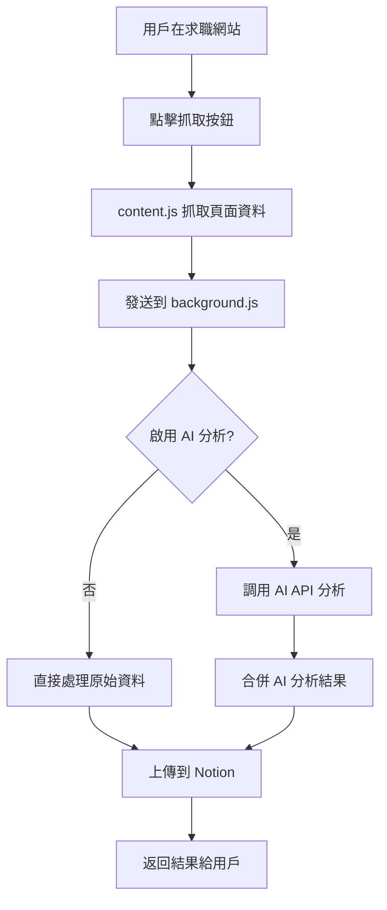
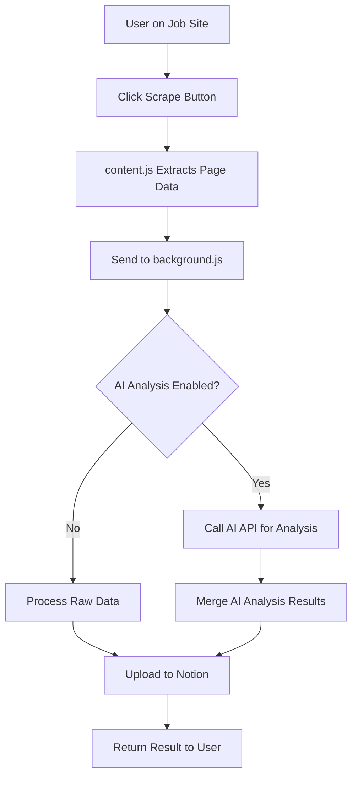

# Universal Job Scraper 多平台職缺抓取工具

[](https://github.com/your-username/universal-job-scraper)
[](LICENSE)
[](https://developer.mozilla.org/docs/Web/JavaScript)
[](https://developer.chrome.com/docs/extensions/mv3/)

> 🚀 一鍵抓取各大求職網站職缺到 Notion，支援 AI 智慧分析和多語言介面

[English](#english) | [中文](#中文)

---

## 中文

### 📋 功能特色

- **🌐 多平台支援**：支援 LinkedIn、104人力銀行、1111人力銀行、Yourator、CakeResume
- **🤖 AI 智慧分析**：支援 OpenAI 和 OpenRouter，自動分析職缺內容並提取關鍵資訊
- **📊 Notion 整合**：一鍵將職缺資料儲存到您的 Notion 資料庫
- **🌍 多語言支援**：提供繁體中文和英文介面
- **⚡ 自動化流程**：智慧選擇父頁面、自動建立資料庫
- **🔧 彈性設定**：支援自定義資料庫欄位和 AI 模型選擇

### 🌐 支援的求職網站

| 網站 | URL 匹配模式 | 狀態 |
|------|-------------|------|
| **LinkedIn** | `linkedin.com/jobs/view/*` | ✅ 完全支援 |
| **104人力銀行** | `104.com.tw/job/*` | ✅ 完全支援 |
| **1111人力銀行** | `1111.com.tw/job/*` | ✅ 完全支援 |
| **Yourator** | `yourator.co/jobs/*` | ✅ 完全支援 |
| **CakeResume** | `cakeresume.com/jobs/*` | ✅ 完全支援 |

### 🛠️ 安裝方式

#### 方法 1：Chrome Web Store（推薦）
*即將上架，敬請期待*

#### 方法 2：開發者模式安裝

1. **下載專案**
   ```bash
   git clone https://github.com/your-username/universal-job-scraper.git
   cd universal-job-scraper
   ```

2. **開啟 Chrome 擴充功能頁面**
   - 開啟 Chrome 瀏覽器
   - 前往 `chrome://extensions/`
   - 開啟右上角的「開發人員模式」

3. **載入擴充功能**
   - 點擊「載入未封裝項目」
   - 選擇專案資料夾
   - 確認擴充功能已成功載入

### 🚀 快速開始

#### 1. 設定 Notion Integration

1. **取得 Notion Token**
   - 前往 [Notion Integrations](https://www.notion.so/my-integrations)
   - 點擊「+ New integration」
   - 填入基本資訊並建立 Integration
   - 複製 `Internal Integration Token`

2. **準備 Notion 頁面**
   - 在 Notion 中建立一個用於存放職缺的頁面
   - 在頁面設定中，邀請您剛建立的 Integration

#### 2. 設定擴充功能

1. **開啟擴充功能**
   - 點擊瀏覽器工具列的擴充功能圖示
   - 或使用快捷鍵打開

2. **Notion 設定**
   - 點擊「⚙️ Notion 設定」展開設定區塊
   - 填入 Integration Token
   - 點擊「📥 載入可用頁面」
   - 選擇父頁面
   - 選擇現有資料庫或建立新資料庫
   - 點擊「💾 儲存設定」

3. **AI 設定（可選）**
   - 開啟「🤖 啟用 AI 分析」
   - 點擊「🤖 AI 設定」展開設定區塊
   - 選擇 AI 平台（OpenAI 或 OpenRouter）
   - 填入 API Key
   - 點擊「🔄 載入模型列表」並選擇模型
   - 點擊「💾 儲存 AI 設定」

#### 3. 開始抓取職缺

1. **前往支援的求職網站**
2. **開啟職缺詳細頁面**
3. **點擊擴充功能圖示**
4. **點擊「🚀 抓取職缺」按鈕**
5. **等待處理完成，資料將自動儲存到 Notion**

### 📊 資料庫欄位

預設的 Notion 資料庫包含以下欄位：

| 欄位名稱 | 類型 | 說明 |
|---------|------|------|
| 職位名稱 | Title | 職缺標題 |
| 公司 | Rich Text | 公司名稱 |
| 工作地點 | Rich Text | 工作地點 |
| 薪資 | Rich Text | 薪資範圍 |
| 職缺連結 | URL | 原始職缺連結 |
| 申請狀態 | Select | 申請進度追蹤 |
| 申請日期 | Date | 申請時間 |
| 工作描述 | Rich Text | 職缺描述內容 |
| 技能要求 | Multi-select | 所需技能標籤 |
| 備註 | Rich Text | 個人備註 |

### ⚙️ 進階設定

#### AI 分析功能

當啟用 AI 分析時，系統會：
- 📝 自動提取並結構化職缺資訊
- 🏷️ 生成相關技能標籤
- 📊 分析薪資範圍和福利
- 💡 提供職缺亮點摘要

#### 支援的 AI 平台

- **OpenAI**：支援 GPT-3.5、GPT-4 等模型
- **OpenRouter**：支援多種開源和商業模型

### 🔧 開發資訊

#### 技術架構

- **Manifest Version**: 3
- **核心技術**: Vanilla JavaScript (Functional Programming)
- **API 整合**: Notion API、OpenAI API、OpenRouter API
- **權限**: ActiveTab、Storage、Scripting、Notifications

#### 專案結構

```
JobScrpy/
├── manifest.json          # 擴充功能配置
├── popup.html             # 彈出視窗 UI
├── popup.js               # 彈出視窗邏輯 (Functional Programming)
├── content.js             # 內容腳本 (Functional Programming)
├── background.js          # 背景服務
├── _locales/              # 多語言支援
│   ├── en/messages.json   # 英文語言包
│   └── zh_TW/messages.json # 繁體中文語言包
├── icons/                 # 圖示檔案
│   ├── icon-16.png
│   ├── icon-32.png
│   ├── icon-48.png
│   └── icon-128.png
├── NOTION_OAUTH_IMPLEMENTATION.md  # OAuth 實作指南
├── NOTION_IMPROVEMENT_PLAN.md      # 功能改進計劃
└── README.md              # 專案說明
```

#### 本地開發

1. **複製專案**
   ```bash
   git clone https://github.com/your-username/universal-job-scraper.git
   cd universal-job-scraper
   ```

2. **安裝到 Chrome**
   - 開啟 `chrome://extensions/`
   - 啟用開發者模式
   - 載入未封裝項目

3. **開發和除錯**
   - 修改程式碼後重新載入擴充功能
   - 使用 Chrome DevTools 進行除錯
   - 查看 Console 輸出和網路請求

#### 核心功能流程



### 🔮 未來計劃

- [ ] **OAuth 2.0 整合**：[實作指南](NOTION_OAUTH_IMPLEMENTATION.md)
- [ ] **批量處理**：一次抓取多個職缺
- [ ] **自動申請追蹤**：自動更新申請狀態
- [ ] **履歷匹配**：AI 分析職缺與履歷的匹配度
- [ ] **薪資分析**：市場薪資趨勢分析
- [ ] **更多求職網站**：擴展支援更多平台

### ❓ 常見問題

#### Q: 為什麼無法載入 Notion 頁面？
A: 請確認：
- Integration Token 是否正確
- Integration 是否已邀請到目標頁面
- 網路連接是否正常

#### Q: AI 分析功能無法使用？
A: 請檢查：
- AI API Key 是否有效
- 是否選擇了正確的模型
- API 額度是否充足

#### Q: 支援哪些職缺網站？
A: 目前支援 LinkedIn、104、1111、Yourator、CakeResume。未來會陸續新增更多平台。

#### Q: 如何自定義資料庫欄位？
A: 您可以在 Notion 中手動修改資料庫欄位，擴充功能會自動適應大部分的欄位變更。

### 🤝 貢獻指南

歡迎貢獻程式碼、回報問題或提出建議！

1. **Fork 專案**
2. **建立功能分支**: `git checkout -b feature/amazing-feature`
3. **提交變更**: `git commit -m 'Add some amazing feature'`
4. **推送分支**: `git push origin feature/amazing-feature`
5. **開啟 Pull Request**

### 📞 聯絡資訊

- **問題回報**: [GitHub Issues](https://github.com/your-username/universal-job-scraper/issues)
- **功能建議**: [GitHub Discussions](https://github.com/your-username/universal-job-scraper/discussions)
- **Email**: your-email@example.com

### 📄 授權條款

本專案採用 [MIT 授權條款](LICENSE)。

---

## English

### 📋 Features

- **🌐 Multi-Platform Support**: Support for LinkedIn, 104, 1111, Yourator, CakeResume
- **🤖 AI Smart Analysis**: Supports OpenAI and OpenRouter for automatic job content analysis
- **📊 Notion Integration**: One-click save job data to your Notion database
- **🌍 Multi-Language**: Traditional Chinese and English interface
- **⚡ Automated Workflow**: Smart parent page selection and auto database creation
- **🔧 Flexible Configuration**: Custom database fields and AI model selection

### 🌐 Supported Job Sites

| Site | URL Pattern | Status |
|------|-------------|--------|
| **LinkedIn** | `linkedin.com/jobs/view/*` | ✅ Full Support |
| **104** | `104.com.tw/job/*` | ✅ Full Support |
| **1111** | `1111.com.tw/job/*` | ✅ Full Support |
| **Yourator** | `yourator.co/jobs/*` | ✅ Full Support |
| **CakeResume** | `cakeresume.com/jobs/*` | ✅ Full Support |

### 🛠️ Installation

#### Method 1: Chrome Web Store (Recommended)
*Coming soon*

#### Method 2: Developer Mode

1. **Download Project**
   ```bash
   git clone https://github.com/your-username/universal-job-scraper.git
   cd universal-job-scraper
   ```

2. **Open Chrome Extensions Page**
   - Open Chrome browser
   - Navigate to `chrome://extensions/`
   - Enable "Developer mode" in top right

3. **Load Extension**
   - Click "Load unpacked"
   - Select project folder
   - Confirm extension is loaded successfully

### 🚀 Quick Start

#### 1. Setup Notion Integration

1. **Get Notion Token**
   - Go to [Notion Integrations](https://www.notion.so/my-integrations)
   - Click "+ New integration"
   - Fill in basic info and create integration
   - Copy the `Internal Integration Token`

2. **Prepare Notion Page**
   - Create a page in Notion for storing job data
   - In page settings, invite your newly created integration

#### 2. Configure Extension

1. **Open Extension**
   - Click extension icon in browser toolbar
   - Or use keyboard shortcut

2. **Notion Settings**
   - Click "⚙️ Notion Configuration" to expand settings
   - Enter Integration Token
   - Click "📥 Load Available Pages"
   - Select parent page
   - Choose existing database or create new one
   - Click "💾 Save Configuration"

3. **AI Settings (Optional)**
   - Enable "🤖 Enable AI Analysis"
   - Click "🤖 AI Configuration" to expand settings
   - Choose AI platform (OpenAI or OpenRouter)
   - Enter API Key
   - Click "🔄 Load Model List" and select model
   - Click "💾 Save AI Configuration"

#### 3. Start Scraping Jobs

1. **Navigate to supported job site**
2. **Open job detail page**
3. **Click extension icon**
4. **Click "🚀 Scrape Job" button**
5. **Wait for processing, data will be saved to Notion automatically**

### 📊 Database Schema

Default Notion database includes these fields:

| Field Name | Type | Description |
|------------|------|-------------|
| Job Title | Title | Job position title |
| Company | Rich Text | Company name |
| Location | Rich Text | Work location |
| Salary | Rich Text | Salary range |
| Job URL | URL | Original job posting link |
| Application Status | Select | Application progress tracking |
| Application Date | Date | When applied |
| Job Description | Rich Text | Job description content |
| Skills Required | Multi-select | Required skill tags |
| Notes | Rich Text | Personal notes |

### ⚙️ Advanced Configuration

#### AI Analysis Features

When AI analysis is enabled, the system will:
- 📝 Automatically extract and structure job information
- 🏷️ Generate relevant skill tags
- 📊 Analyze salary range and benefits
- 💡 Provide job highlight summaries

#### Supported AI Platforms

- **OpenAI**: Supports GPT-3.5, GPT-4, and other models
- **OpenRouter**: Supports various open-source and commercial models

### 🔧 Development Information

#### Technical Architecture

- **Manifest Version**: 3
- **Core Technology**: Vanilla JavaScript (Functional Programming)
- **API Integration**: Notion API, OpenAI API, OpenRouter API
- **Permissions**: ActiveTab, Storage, Scripting, Notifications

#### Project Structure

```
JobScrpy/
├── manifest.json          # Extension configuration
├── popup.html             # Popup window UI
├── popup.js               # Popup window logic (Functional Programming)
├── content.js             # Content script (Functional Programming)
├── background.js          # Background service
├── _locales/              # Multi-language support
│   ├── en/messages.json   # English language pack
│   └── zh_TW/messages.json # Traditional Chinese language pack
├── icons/                 # Icon files
│   ├── icon-16.png
│   ├── icon-32.png
│   ├── icon-48.png
│   └── icon-128.png
├── NOTION_OAUTH_IMPLEMENTATION.md  # OAuth implementation guide
├── NOTION_IMPROVEMENT_PLAN.md      # Feature improvement plan
└── README.md              # Project documentation
```

#### Local Development

1. **Clone Project**
   ```bash
   git clone https://github.com/your-username/universal-job-scraper.git
   cd universal-job-scraper
   ```

2. **Install to Chrome**
   - Open `chrome://extensions/`
   - Enable developer mode
   - Load unpacked extension

3. **Development and Debugging**
   - Reload extension after code changes
   - Use Chrome DevTools for debugging
   - Check Console output and network requests

#### Core Functionality Flow



### 🔮 Future Plans

- [ ] **OAuth 2.0 Integration**: [Implementation Guide](NOTION_OAUTH_IMPLEMENTATION.md)
- [ ] **Batch Processing**: Scrape multiple jobs at once
- [ ] **Auto Application Tracking**: Automatically update application status
- [ ] **Resume Matching**: AI analysis of job-resume compatibility
- [ ] **Salary Analysis**: Market salary trend analysis
- [ ] **More Job Sites**: Expand support for more platforms

### ❓ FAQ

#### Q: Why can't I load Notion pages?
A: Please confirm:
- Integration Token is correct
- Integration has been invited to target page
- Network connection is stable

#### Q: AI analysis feature not working?
A: Please check:
- AI API Key is valid
- Correct model is selected
- API quota is sufficient

#### Q: Which job sites are supported?
A: Currently supports LinkedIn, 104, 1111, Yourator, CakeResume. More platforms will be added in the future.

#### Q: How to customize database fields?
A: You can manually modify database fields in Notion, and the extension will automatically adapt to most field changes.

### 🤝 Contributing

Contributions, issues, and feature requests are welcome!

1. **Fork the project**
2. **Create feature branch**: `git checkout -b feature/amazing-feature`
3. **Commit changes**: `git commit -m 'Add some amazing feature'`
4. **Push to branch**: `git push origin feature/amazing-feature`
5. **Open Pull Request**

### 📞 Contact

- **Bug Reports**: [GitHub Issues](https://github.com/your-username/universal-job-scraper/issues)
- **Feature Requests**: [GitHub Discussions](https://github.com/your-username/universal-job-scraper/discussions)
- **Email**: your-email@example.com

### 📄 License

This project is licensed under the [MIT License](LICENSE).

---

## 🙏 Acknowledgments

- [Notion API](https://developers.notion.com/) - For providing excellent database integration
- [OpenAI](https://openai.com/) - For AI analysis capabilities
- [OpenRouter](https://openrouter.ai/) - For diverse AI model access
- [Chrome Extensions](https://developer.chrome.com/docs/extensions/) - For the extension platform

---

**Made with ❤️ by [Your Name]**